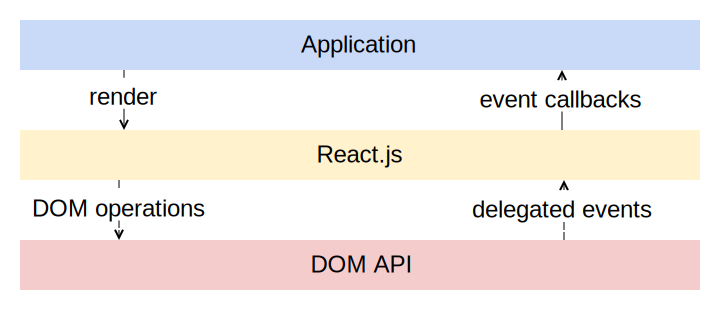
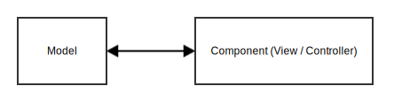
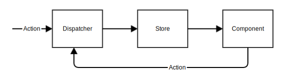
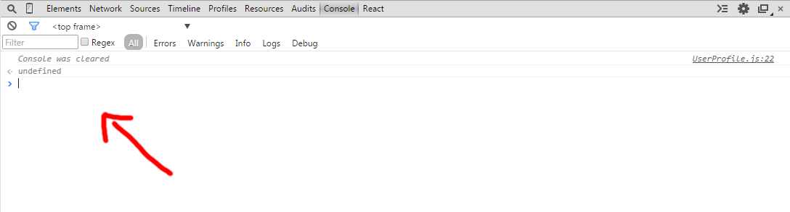
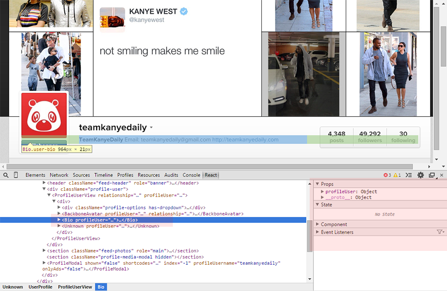
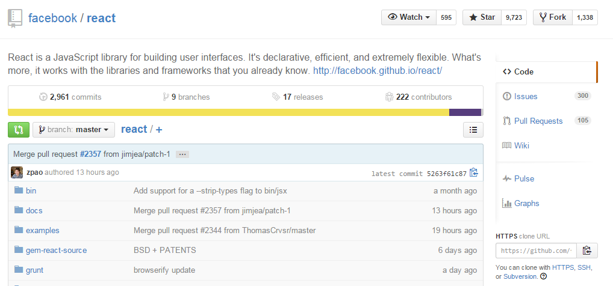

React.js et l'avenir de l'interface utilisateur HTML5
=====================================================

Thibaut Séguy / <a href="https://twitter.com/thibautseguy">@thibautseguy</a>

bdx.io #2014

~~~~

Pourquoi React ?
----------------

* Composition d'interfaces intuitive et rapide
* Rapide à maîtriser
* Adapté à tous les niveaux
* Ouvert

~~~~

React c'est quoi ?
------------------

* Un outil de création d'UI développé chez Facebook
* Un framework javascript client-side ? Non !
* Le V de MVC ? Pas vraiment
* <strong>Une abstraction du DOM</strong>

~~~~



~~~~

Comment ça s'utilise ?
----------------------

* React est fondé sur l'idée de <strong>composants</strong> ...
* ayant une <strong>sémantique proche des éléments HTML</strong>
* construits autour d'une méthode : <strong>render()</strong>
* d'attributs : <strong>this.props</strong>
* et d'un état interne : <strong>this.state</strong>

~~~~

```javascript
var html = React.DOM;

var Hello = React.createClass({
  render: function() {
    return html.div({}, 'Hello, ' + this.props.name + ' !');
  }
});

React.renderComponent(
  Hello({ name: 'bdx.io' }),
  document.body
);
```

~~~~

```javascript
var html = React.DOM;

var Counter = React.createClass({
  getInitialState: function() {
    return { count: 0 };
  },

  handleClick: function() {
    this.setState({
      count: this.state.count + 1
    });
  },

  render: function() {
    return html.button(
      { onClick: this.handleClick }, 
      this.props.text + ' ' + this.state.count
    );
  }
});

React.renderComponent(
  Counter({ text: 'Click me !'}),
  document.body
);
```

~~~~

Le virtual DOM
--------------

Lors d'une modification du state ou des props d'un composant : 

* <strong>Rerender</strong> complet du DOM tree
* <strong>Diffing</strong> avec le tree précédent
* <strong>Génération du set de modifications</strong> minimal
* <strong>Mise à jour du DOM</strong> par batches

~~~~

Les avantages du Virtual DOM
----------------------------

* Performances optimales
* Raisonnement simplifié
* DOM toujours synchro avec l'état des composants

~~~~

Cycle de vie des composants
---------------------------

```javascript
var MyComponent = React.createClass({

  componentWillMount: function() {},
  componentDidMount: function() {},

  componentWillUpdate: function() {},
  componentDidUpdate: function() {},

  componentWillUnmount: function() {},

  shouldComponentUpdate: function() {}
});
```

~~~~

Simplifier la construction du DOM : JSX
---------------------------------------

```javascript
var html = React.DOM;

var Table = React.createClass({
  renderColumn: function(column) {
    return html.th(null, column);
  },
  renderRow: function(rows) {
    return html.tr(null, rows.map(this.renderCell));
  },
  renderCell: function(cell) {
    return html.td(null, cell);
  },
  render: function() {
    return (
      html.table(null, 
        html.thead(null, 
          html.tr(null, this.props.columns.map(this.renderColumn))
        ),
        html.tbody(null, this.props.rows.map(this.renderRow))
      )
    );
  }
});
```

~~~~

Simplifier la construction du DOM : JSX
---------------------------------------

```javascript
var Table = React.createClass({
  renderColumn: function(column) {
    return <th>{ column }</th>;
  },
  renderRow: function(rows) {
    return <tr>{ rows.map(this.renderCell) }</tr>;
  },
  renderCell: function(cell) {
    return <td>{ cell }</td>;
  },
  render: function() {
    return (
      <table>
        <thead>
          <tr>{ this.props.columns.map(this.renderColumn) }</tr>
        </thead>
        <tbody>
          { this.props.rows.map(this.renderRow) }
        </tbody>
      </table>
    );
  }
});
```

~~~~

Les avantages du JSX
--------------------

* Lisibilité et simplicité d'écriture
* Toute l'expressivité de la syntaxe JS disponible
* Accessible aux webdesigners
* Numéros de lignes préservés
* Totalement optionnel

~~~~

Architecture d'application avec React
-------------------------------------

* Modèle, routage : librairies externes
* Unixy : <em>"do one thing and do it well"</em>
* Encourage au découplage du code métier

~~~~

Architecture libre : MVC ...
-----------------------------------



~~~~

Architecture libre : Flux ...
-----------------------------------



~~~~

Architecture libre : ou autre ...
-----------------------------------


~~~~

Organisation des fichiers libre
-------------------------------

```
- app
  - pages/
    - home.js
    - login.js
    - users.js
    - user.js
  - components/
    - table.js
    - button.js
    - form.js
  - application.js
```

~~~~

Packaging des composants
------------------------

* Utilisation possible de CommonJS

```javascript
var Avatar = require('avatar');

var UserProfile = React.createClass({
  render: function() {
    return (
      <div>
        <Avatar userId={this.props.user.id} />
        {this.props.user.name}
      </div>
    );
  }
});

module.exports = UserProfile
```

* npm install ...
* browserify, webpack, stitch ...

~~~~


Pérennité du code et transition vers React
------------------------------------------

* Pas de lock-in
* React peut ne s'occuper que d'une partie du DOM
```javascript
React.renderComponent(
  <GoogleMap lat="28.467" long="-80.567" />,
  document.getElementById('map')
);
```
* React peut encapsuler des libs externes
```javascript
var Dialog = React.createClass({
  render: function() {
    return <div></div>;
  },
  shouldComponentUpdate: function() {
    return false;
  },
  componentDidMount: function() {
    $(this.getDOMNode()).dialog();
  }
});
```

~~~~

Debugging : aide dans la console
--------------------------------



~~~~

Debugging : extension navigateur
--------------------------------



~~~~

React en production
-------------------

* Facebook, Instagram
* Yahoo! Mail
* AirBnB
* Reddit, Netflix, New York Times, Electronic Arts, Mozilla ...
* Atom (Github)
* Adobe Brackets

~~~~

Historique et communauté
------------------------

* Initié il y a quelques années chez Facebook
* Open source depuis mai 2013
* Une centaine de commiters indépendants
* Licence BSD

~~~~



~~~~

Mon expérience
--------------

* Application développée sur 6 mois avec Backbone
* Complexité = O(n<sup>wtf</sup>)
* En particulier : composition difficile
* Application réécrite avec React en 2 semaines
* Base de code maintenable
* Complexité maîtrisée

~~~~

Les bénéfices pour le développeur et l'entreprise
-------------------------------------------------

* Modèle conceptuel simple
* Opérationnel rapidement
* Accessible aux débutants
* Refactoring-friendly

~~~~

Par où commencer :
------------------

* Starter project : <a href="https://github.com/thibauts/react-starter">https://github.com/thibauts/react-starter</a>
* Tour d'horizon  : <a href="https://github.com/thibauts/talk-react-bordeauxjs">https://github.com/thibauts/talk-react-bordeauxjs</a>

~~~~

Pour conclure
-------------

* Investissez quelques heures pour tester, vous ne le regretterez pas
* Un changement de paradigme
* Une nouvelle page dans le développement d'UI HTML5 ?
* Participez à l'écrire !

~~~~

Merci !
===============

<a href="https://twitter.com/thibautseguy">@thibautseguy</a>

<a href="https://github.com/thibauts">github.com/thibauts</a>

